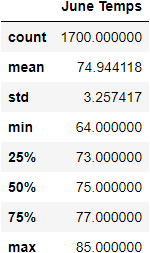
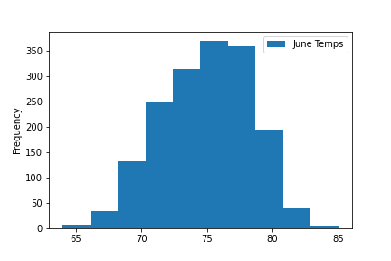
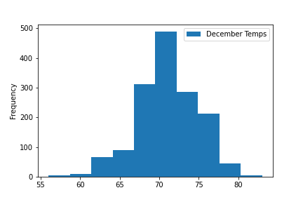

# SurfsUp Challenge
[SurfsUp_Challenge.ipynb](./SurfsUp_Challenge.ipynb)

## Overview: 
Gather more information for W.Avy about the temperature trends before he opens up his surf shop. Specifically, get temperature data for the months of June and December in Oahu, in order to determine if the surf and ice cream shop business is sustainable year-round.

## Results
### June Temperature Results
#### The following results encompass all the June months from 2010 to 2017:
- There was a total of 1700 data points collected.
- The average temperature is approximately 74.94°F.
- The median temperature is 75°F.
- The maximum temperature is 85°F. 
- The minimum temperature is 64°F.

### December Temperature Results
#### The following results encompass the December months from 2010 to 2017:
- There was a total of 1517 data points collected.
- The average temperature is approximately 71.04°F.
- The median temperature is 71°F.
- The maximum temperature is 83°F. 
- The minimum temperature is 56°F.

## Summary
There were enough data points collected to get accurate results. The difference in average temperatures between June and December is 3.9°F. The difference in median temperatures is 4°F. The difference in maximum temperatures is 2°F. The difference in minimum temperatures is 8°F. 

The following histograms of the temperature data for June and December also show that the two months are very similar in temperature, with the histograms having similar centers and spreads of data. December's temperatures have a slightly wider spread due to lower temperatures being reached during that month.

So it is safe to say that the surf shop and ice cream shop would be sustainable year-round. Since the biggest difference is in the minimum temperatures, more information about what time temperatures are the lowest in December would be help in determining shop hours. Precipitation may also be helpful to look into for June and December because precipitation may affect whether potential customers decide to go to the shop or not.

